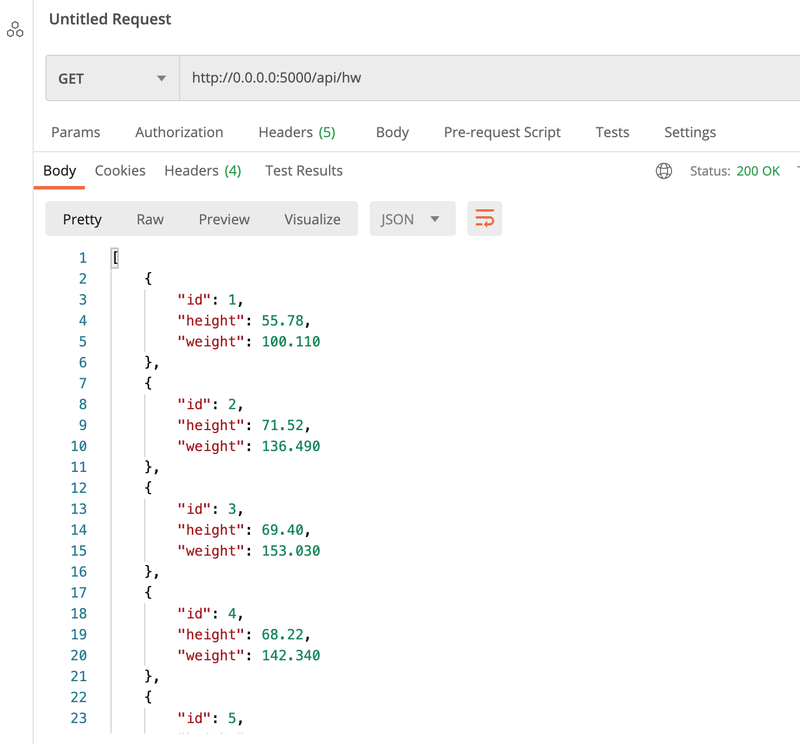
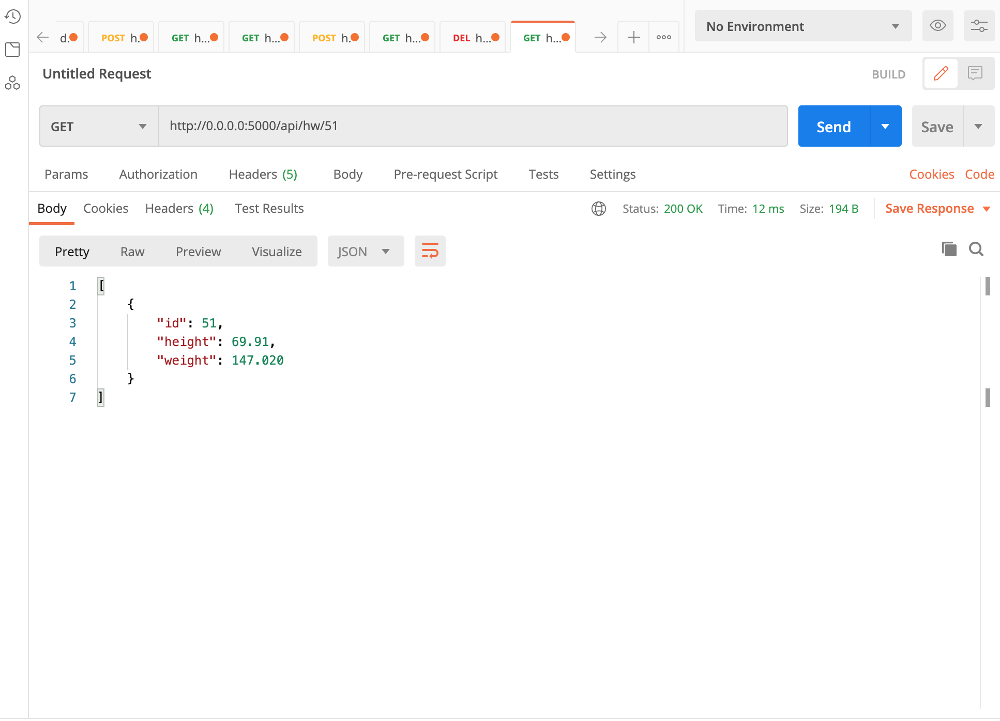
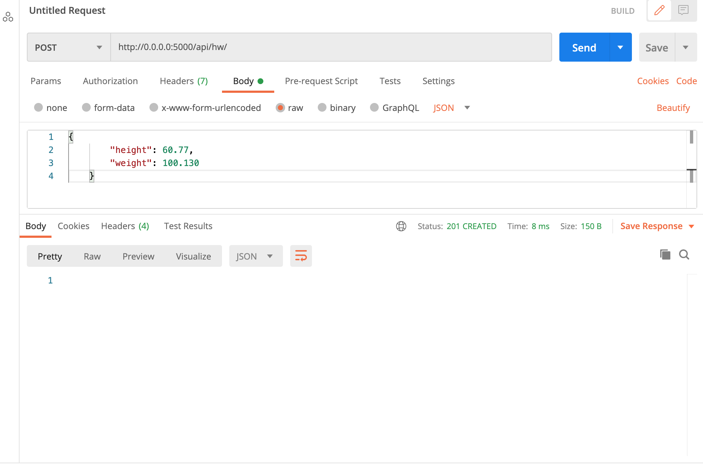
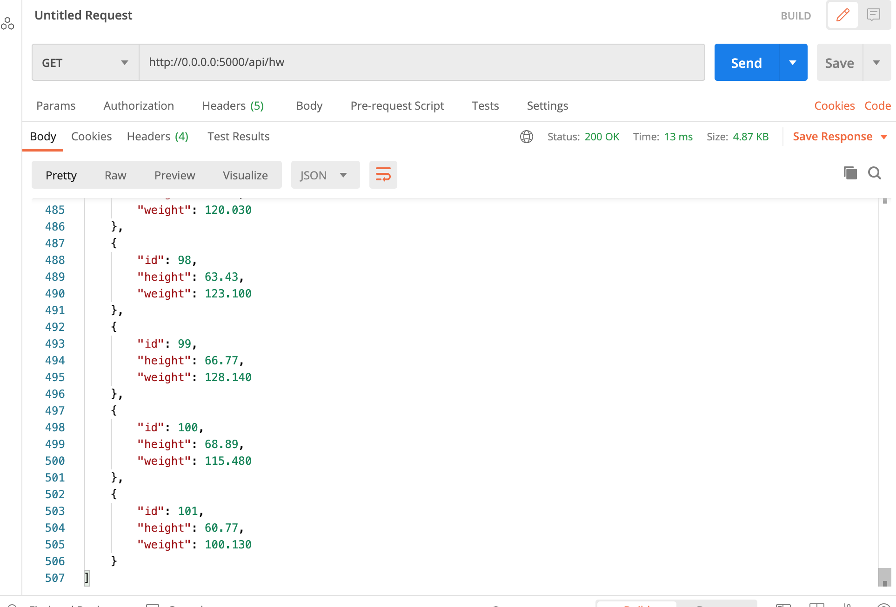
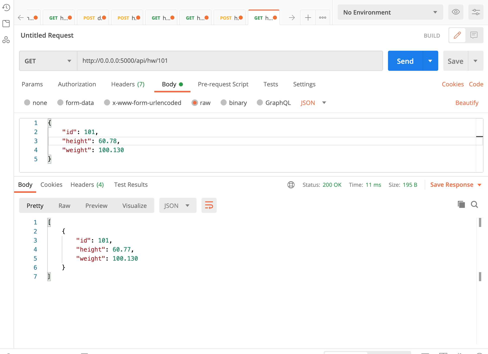
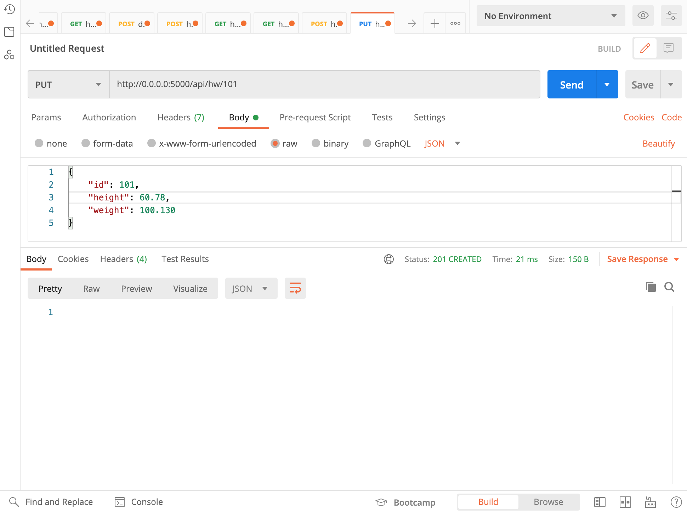
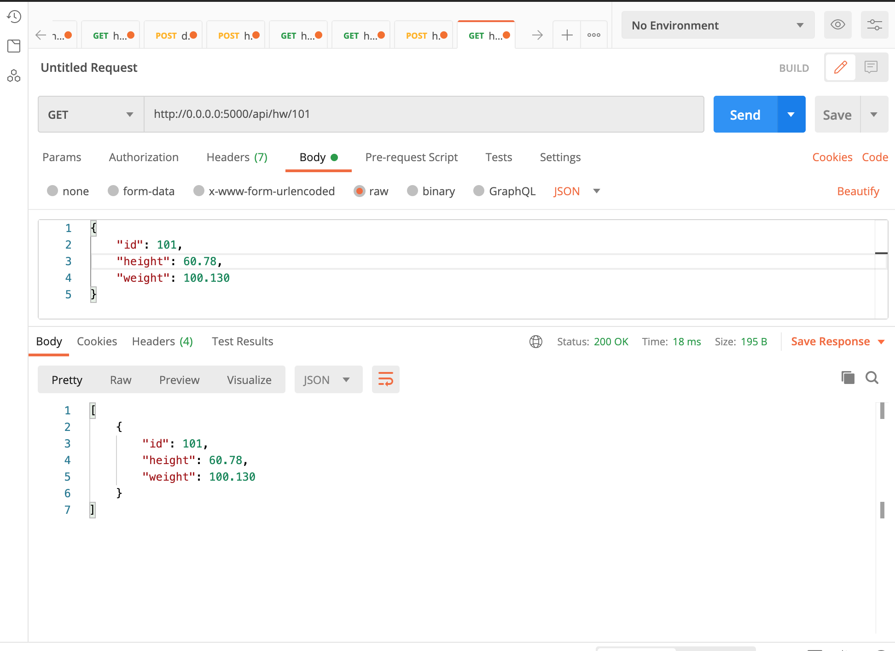
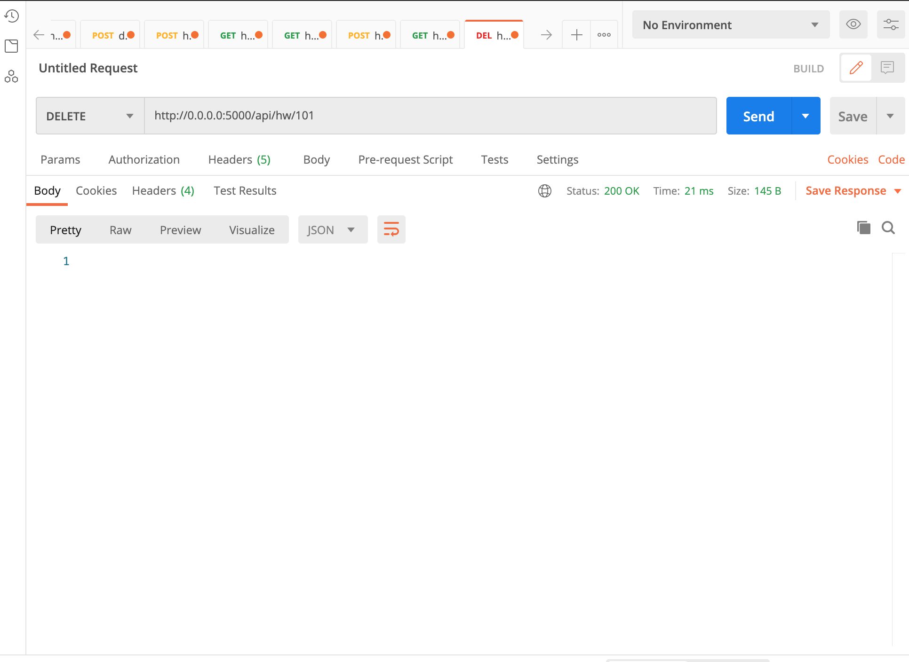
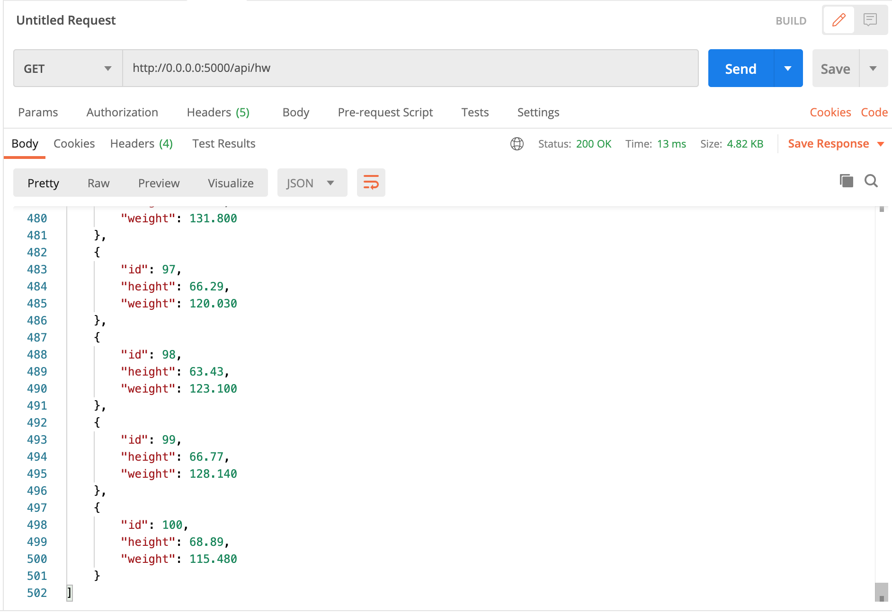

# Project Description
This project is a final assignment to teach how to get Pycharm setup with Docker, Flask, MySQL, Postman and Bootstrap. It will demonstrate the use of an API in order to manipulate data in the database.

## API Get All

## API Get One

## API Post

## API Post Verify

## API Put Before

## API Put

## API Put Verify

## API Delete

## API Delete Verify
